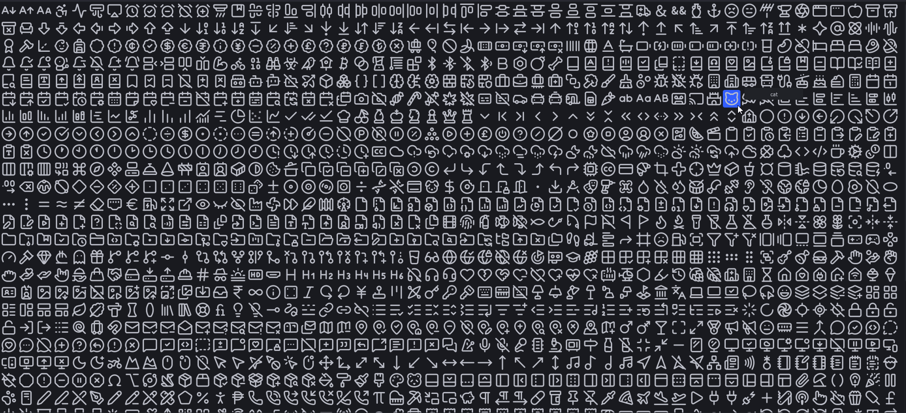

# Lucide Icon Picker

A Roblox Studio plugin for browsing and inserting [Lucide](https://lucide.dev) icons into your UI.



## Usage

1. Open the plugin from the toolbar
2. Search or browse the 1,706 icons
3. Click an icon to select it
4. Hit **Apply** to insert it into the selected `ImageLabel` or `ImageButton`

## Building from source

```bash
aftman install
wally install
npm install         # (optional only if you are adding more icons)
npm run generate    # (optional only if you are adding more icons)
```

Upload `sprite1.png` and `sprite2.png` to Roblox as Decals, then replace the asset IDs in `src/Modules/Assets.luau`.

```bash
rojo build --output LucideIconPicker.rbxm
```

## License

Icons from [Lucide](https://lucide.dev) — ISC License. See [LICENSE](LICENSE).
